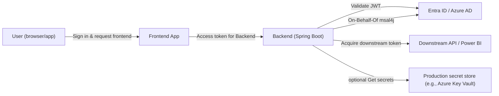
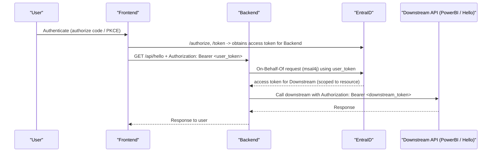

# Java Spring Boot MSAL PoC (Azure Entra ID)

A minimal Spring Boot backend demonstrating how to:

- Validate incoming Azure Entra ID (Azure AD) access tokens (Resource Server).
- Perform On-Behalf-Of (OBO) calls using MSAL for Java (msal4j) to call downstream APIs.
- Check group membership from the token for authorization.
- Load secrets locally for development (via `LocalSecretsService`).

This repository focuses on the backend work required when integrating with Azure Entra ID; it does not include an example frontend UI. The README includes simple steps to obtain tokens (Postman) and test the backend locally.

Quickstart (local)
------------------
Prerequisites
- Java 17
- Maven
- An Azure AD (Entra ID) tenant and permission to register test apps

1) Register apps in Azure AD
- Register a **Backend** app (confidential client):
  - Note Application (client) ID and Directory (tenant) ID.
  - Under "Expose an API" add a scope (example: `api://{backend-client-id}/access_as_user`).
  - Under "Certificates & secrets" create a client secret (store it securely).
- (Optional) Register a **Frontend** app (SPA/web) if you prefer an end-to-end browser demo. The frontend should request the backend scope from the backend app.

2) Configure the application locally
Open `src/main/resources/application.properties` and set the following values (or set environment variables):

```
azure.client-id=YOUR_BACKEND_CLIENT_ID
azure.client-secret=YOUR_BACKEND_CLIENT_SECRET
azure.tenant-id=YOUR_TENANT_ID
azure.required-group-id=REQUIRED_GROUP_OBJECT_ID
spring.security.oauth2.resourceserver.jwt.issuer-uri=https://login.microsoftonline.com/${azure.tenant-id}/v2.0
```

3) Build and run the backend
```
mvn spring-boot:run
```
The server listens on http://localhost:8080 by default.

How to get a user access token (Postman quick method)
----------------------------------------------------
Use Postman to perform an Authorization Code flow for the Frontend registration and request the backend scope:
- In Postman, create a new Request -> Authorization, choose OAuth 2.0 -> Get New Access Token.
- Authorization URL: `https://login.microsoftonline.com/{tenant}/oauth2/v2.0/authorize`
- Token URL: `https://login.microsoftonline.com/{tenant}/oauth2/v2.0/token`
- Client ID: frontend client id (or backend client id if using a confidential client for testing)
- Client Secret: fill if using a confidential client flow
- Scope: `api://{backend-client-id}/access_as_user openid profile`
- Redirect URI: the same URI registered for your client in Azure
- Click Get New Access Token and sign in interactively. Postman will return a token you can use.

Calling the backend (examples)
------------------------------
Assuming you have a valid user access token for the backend scope:

- Hello (local):
  curl -H "Authorization: Bearer <USER_ACCESS_TOKEN>" "http://localhost:8080/api/hello/local?name=world"

- Check group membership (will return 403 if not a member):
  curl -H "Authorization: Bearer <USER_ACCESS_TOKEN>" "http://localhost:8080/api/hello/check-group"

- Call Power BI reports (OBO):
  curl -H "Authorization: Bearer <USER_ACCESS_TOKEN>" "http://localhost:8080/api/powerbi/reports"

What this repo demonstrates
---------------------------
- Token validation (Resource Server): implemented in `SecurityConfig` to validate JWTs issued by Entra ID.
- Group-based authorization: the `groups` claim is mapped to authorities and checked by controllers (see `HelloController`).
- OBO with MSAL: `MsalService` shows how to call downstream APIs on behalf of the user.
- Local secrets for development: `LocalSecretsService` reads from `application.properties`. Replace or extend this with a production-backed `SecretsService` (e.g., using Azure Key Vault) in production.

Architecture diagram
--------------------
Mermaid diagrams (flowchart + sequence). If your viewer does not render Mermaid, an ASCII fallback follows.

Mermaid flowchart (high-level):



Mermaid sequence diagram (detailed OBO flow):



ASCII fallback (minimal):

User -> Frontend -> Backend -> Entra ID -> Downstream API

Troubleshooting and tips
------------------------
- 401 Unauthorized / invalid token: ensure `spring.security.oauth2.resourceserver.jwt.issuer-uri` matches your tenant and the token's issuer.
- Token missing backend scope: ensure the token contains the scope matching the backend's exposed API (e.g., `api://{backend-client-id}/access_as_user`).
- Group check returns 403: verify the token contains the `groups` claim or fetch group membership server-side if the token has overage.

Production notes
----------------
- Do not store client secrets in source control.
- For production, use a secure secret store (Azure Key Vault) and implement a production `SecretsService` backed by that store.
- Ensure correct, least-privilege permissions and admin consent where necessary (Power BI scopes often require tenant admin consent).

AWS hosting notes (if you host the app on AWS)
---------------------------------------------
This repository does not include AWS-specific implementations, but the notes below explain how you would wire this project into an AWS-hosted environment using AWS Secrets Manager and IAM. No code is changed in the repo — these are operational notes you can follow or adapt.

1) Secret format (recommended)
Store a single JSON secret in AWS Secrets Manager containing the confidential values the backend needs:

```json
{
  "clientId": "<BACKEND_CLIENT_ID>",
  "clientSecret": "<BACKEND_CLIENT_SECRET>",
  "tenantId": "<TENANT_ID>",
  "requiredGroupId": "<REQUIRED_GROUP_OBJECT_ID>"
}
```

2) IAM permissions (least privilege example)
Grant the runtime identity (EC2/IAM role, ECS task role, or EKS service account) permission only to read the specific secret:

```json
{
  "Version": "2012-10-17",
  "Statement": [
    {
      "Effect": "Allow",
      "Action": ["secretsmanager:GetSecretValue"],
      "Resource": ["arn:aws:secretsmanager:REGION:ACCOUNT_ID:secret:your-secret-name*"]
    }
  ]
}
```

3) Runtime / profile guidance
- Use the standard AWS SDK DefaultCredentialsProvider so your app can use IAM role credentials on AWS and developer credentials locally.
- Consider a Spring profile `aws` that, when enabled, instructs your deployment to read secrets from Secrets Manager and populate the application's secret supplier (the repo uses `SecretsService` as the abstraction).
- For development you can keep `LocalSecretsService` and read values from `application.properties` or environment variables.

4) Networking / egress
- Ensure your VPC allows outbound access to:
  - login.microsoftonline.com (token issuance)
  - api.powerbi.com (Power BI REST APIs)
  - graph.microsoft.com (if you fetch group membership via Graph)
  - secretsmanager.{region}.amazonaws.com (Secrets Manager)
- Prefer using VPC endpoints for AWS services (Secrets Manager) where possible.

5) Testing
- For smoke tests, export the secrets as environment variables locally (or use `LocalSecretsService`) and run the app with `spring.profiles.active=local`.

References
- Microsoft identity platform: https://learn.microsoft.com/azure/active-directory/develop/
- msal4j: https://github.com/AzureAD/microsoft-authentication-library-for-java
- Power BI REST API: https://learn.microsoft.com/rest/api/power-bi/
